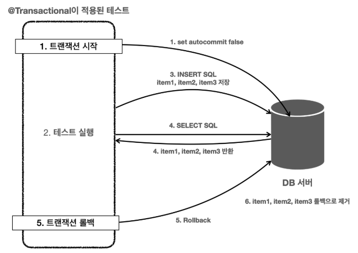

# @Transactional
스프링은 테스트 데이터 초기화를 위해 트랜잭션을 적용하고 롤백하는 방식을 ```@Transactional``` 애노테이션 하나로 깔끔하게 해결해준다.

## 원리
스프링이 제공하는 ```@Transactional``` 애노테이션은 로직이 성공적으로 수행되면 커밋하도록 동작한다.<br>
그런데 ```@Transactional``` 애노테이션을 테스트에서 사용하면 아주 특별하게 동작한다.<br>
```@Transactional```이 테스트에 있으면 스프링은 테스트를 트랜잭션 안에서 실행하고, 테스트가 끝나면 트랜잭션을 자동으로 롤백시켜 버린다.(테스트: 데이터 격리성)

<br>

### @Transactional이 적용된 테스트 동작 방식


1. 테스트에 ```@Transactional```애노테이션이 테스트 메서드나 클래스에 있으면 먼저 트랜잭션을 시작한다.
2. 테스트 로직을 실행한다. 테스트가 끝날 때 까지 모든 로직은 트랜잭션 안에서 수행된다.
   * 트랜잭션은 기본적으로 전파되기 때문에, 리포지토리에서 사용하는 JdbcTemplate도 같은 트랜잭션을 사용한다.
3. 테스트 실행 중에 INSERT SQL을 사용해서 ```item1```, ```item2```, ```item3```를 데이터베이스에 저장한다.
   * 물론 테스트가 리포지토리를 호출하고, 리포지토리는 JdbcTemplate을 사용해서 데이터를 저장한다.
4. 검증을 위해서 SELECT SQL로 데이터를 조회한다. 여기서는 앞서 저장한 item1 , item2 , item3 이 조회되었다.
   * SELECT SQL도 같은 트랜잭션을 사용하기 때문에 저장한 데이터를 조회할 수 있다. 다른 트랜잭션에서는 해당 데이터를 확인할 수 없다.
   * 여기서 assertThat() 으로 검증이 모두 끝난다.
5. @Transactional 이 테스트에 있으면 테스트가 끝날때 트랜잭션을 강제로 롤백한다.
6. 롤백에 의해 앞서 데이터베이스에 저장한 item1 , item2 , item3 의 데이터가 제거된다.

> 참고<br>
> 테스트 케이스의 메서드나 클래스에 ```@Transactional```을 직접 붙여서 사용할 때만 이렇게 동작한다.<br>
> 그리고 트랜잭션을 테스트에서 시작하기 때문에 서비스, 리포지토리에 있는 ```@Transactional```  테스트에서 시작한 트랜잭션에 참여한다.

<br>

### 정리
* 테스트가 끝난 후 개발자가 직접 데이터를 삭제하지 않아도 되는 편리함을 제공한다.
* 테스트 실행 중에 데이터를 등록하고 중간에 테스트가 강제로 종료되어도 걱정이 없다.<br>
  이 경우 트랜잭션을 커밋하지 않기 때문에, 데이터는 자동으로 롤백된다. (보통 데이터베이스 커넥션이 끊어지면 자동으로 롤백되어 버린다.)
* 트랜잭션 범위 안에서 테스트를 진행하기 때문에 동시에 다른 테스트가 진행되어도 서로 영향을 주지 않는 장점이 있다.
* ```@Transactional``` 덕분에 아주 편리하게 다음 원칙을 지킬수 있게 되었다.
  * 테스트는 다른 테스트와 격리해야 한다.
  * 테스트는 반복해서 실행할 수 있어야 한다.

<br>

### 강제로 커밋하기 - @Commit
```@Transactional```을 테스트에서 사용하면 테스트가 끝나면 바로 롤백되기 때문에 테스트 과정에서 저장한 모든 데이터가 사라진다.<br>
당연히 이렇게 되어야 하지만, 정말 가끔은 데이터베이스에 데이터가 잘 보관되었는지 최종 결과를 눈으로 확인하고 싶을 때도 있다.
이럴 때는 다음과 같이 ```@Commit```을 클래스 또는 메서드에 붙이면 테스트 종료후 롤백대신 커밋이 호출된다. 참고로 ```@Rollback(value = false)``` 를 사용해도 된다.
```java
import org.springframework.test.annotation.Commit;

@Commit
@Transactional
@SpringBootTest
class ItemRepositoryTest {}
```