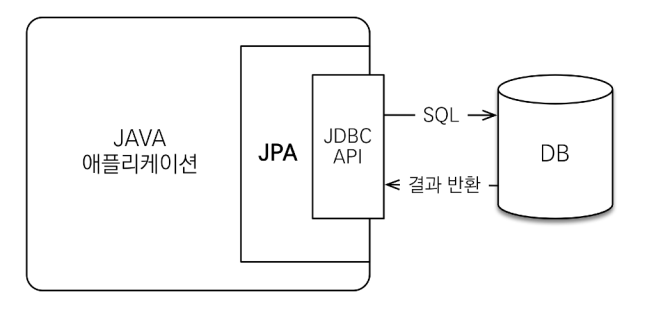
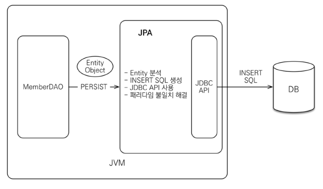
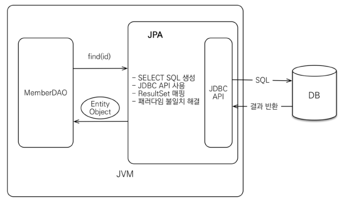
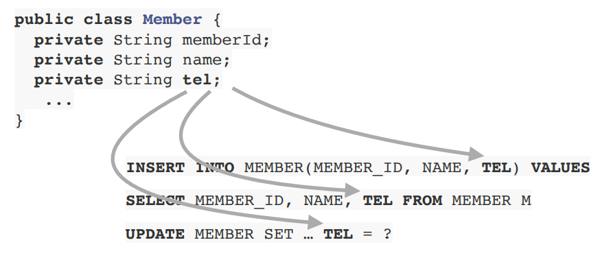
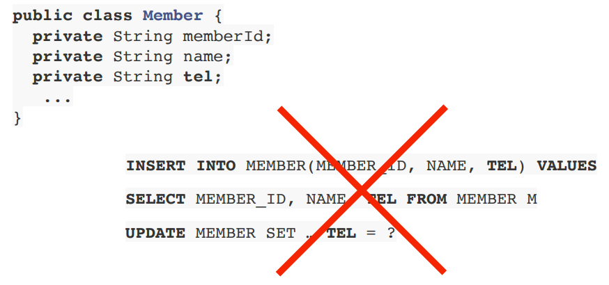
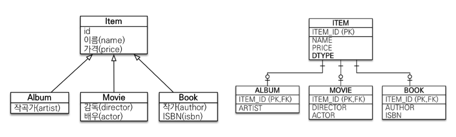

# JPA란?
JPA(Java Persistence API)란 Java 진영의 ORM(Object-Relational Mapping) 기술 표준으로 사용되는 인터페이스의 모음이다.
그 말은 즉, 실제적으로 구현된것이 아니라 구현된 클래스와 매핑을 해주기 위해 사용되는 프레임워크이다.
JPA를 구현한 대표적인 오픈소스로는 Hibernate가 있다.

우선 JPA에 앞서, 먼저 ORM에 대해 알아보도록 하자.

<br>

### ORM(Object-Relational Mapping)
우리가 일반적으로 알고 있는 애플리케이션 Class와 RDB(Relational DataBase)의 테이블을 매핑(연결)한다는 뜻이며, 기술적으로는 애플리케이션의 객체를 RDB 테이블에 자동으로 영속화 해주는 것이라고 보면된다.<br>

<br>

### 그렇다면 우리는 왜 ORM을 사용해야 할까?
우리가 데이터(객체)를 영구 보관하는 다양한 저장소는 RDB, NoSQL, File등등이 있지만 현실적인 대안으로 주로 관계형 데이터베이스(RDS)를 사용하고 관리한다.
그렇다면 객체를 관계형 DB에 저장하려면 어떻게 해야 할까? 객체를 일단 SQL로 바꿔야 한다. 이러한 **SQL 변환**을 누가 할까?<br>
바로 개발자가 한다. 개발자가 중간에서 SQL Mapper 역할을 해주고 있는 것이다. 이 과정이 공수가 많이 발생하는데, 그 이유는 객체와 관계형 데이터베이스의 차이(패러다임의 불일치)때문이다.

* 객체와 관계형 데이터베이스의 차이
  1. 상속
  2. 연관관계
  3. 데이터 타입
  4. 데이터 식별 방법

우리는 ORM을 사용하지 않는다면, RDB는 SQL만 알아듣기 때문에 결국 DB에 저장하기 위해서 SQL 중심적인, 의존적인 개발을 해야만 한다.<br>
ORM을 사용한다면 객체를 객체답게 모델링하면서 개발에만 집중할 수 있게 된다. 그리고 대중적인 언어에는 대부분 orm 기술이 존재한다.

* 장점
  * SQL문이 아닌 Method를 통해 DB를 조작할 수 있어, 개발자는 객체 모델을 이용하여 비즈니스 로직을 구성하는데만 집중할 수 있음.
    (내부적으로는 쿼리를 생성하여 DB를 조작함. 하지만 개발자가 이를 신경 쓰지 않아도됨)
  * Query와 같이 필요한 선언문, 할당 등의 부수적인 코드가 줄어들어, 각종 객체에 대한 코드를 별도로 작성하여 코드의 가독성을 높임
  * 객체지향적인 코드 작성이 가능하다. 오직 객체지향적 접근만 고려하면 되기때문에 생산성 증가
  * 매핑하는 정보가 Class로 명시 되었기 때문에 ERD를 보는 의존도를 낮출 수 있고 유지보수 및 리팩토링에 유리
  * 예를들어 기존 방식에서 MySQL 데이터베이스를 사용하다가 PostgreSQL로 변환한다고 가정해보면, 새로 쿼리를 짜야하는 경우가 생김. 이런 경우에 ORM을 사용한다면 쿼리를 수정할 필요가 없음
* 단점
  * 프로젝트의 규모가 크고 복잡하여 설계가 잘못된 경우, 속도 저하 및 일관성을 무너뜨리는 문제점이 생길 수 있음
  * 복잡하고 무거운 Query는 속도를 위해 별도의 튜닝이 필요하기 때문에 결국 SQL문을 써야할 수도 있음
  * 학습비용이 비쌈

## JPA(Java Persistence API)

### JPA는 애플리케이션과 JDBC 사이에서 동작


### JPA 동작 - 저장


### JPA 동작 - 조회


<br>

## JPA를 왜 사용해야 하는가?
### 1. SQL 중심적인 개발에서 객체 중심으로 개발

<br>

### 2. 생산성
* JPA와 CRUD
  * 저장 : jpa.persist(member)
  * 조회 : Member member = jpa.find(memberId)
  * 수정 : member.setName("변경할 이름")
  * 삭제 : jpa.remove(member)

<br>

### 3. 유지보수
* 기존: 필드 변경시 모든 SQL 수정
  * 
* JPA: 필드만 추가하면 된다, SQL은 JPA가 처리
  * 

<br>

### 4. 패러다임의 불일치 해결

1. 상속
   * 저장 : ```jpa.persist(album);``` -> ```INSERT INTO ITEM ...```, ```INSERT INTO ALBUM ...```
   * 조회 : ```Album album = jpa.find(Album.class, albumId);``` -> ```SELECT I.*, A.* FROM ITEM I JOIN ALBUM A ON I.ITEM_ID = A.ITEM_ID```
2. 연관관계
   * 저장 : ```member.setTeam(team);```<br>&nbsp;&nbsp;&nbsp;&nbsp;&nbsp;&nbsp;&nbsp;&nbsp;&nbsp;
           ```jpa.persist(member);```
3. 객체 그래프 탐색
   * ```Member member = jpa.find(Member.class, memberId);```<br>```Team team = member.getTeam();```
### 5. 성능 최적화
1. 1차 캐시와 동일성(identity)보장
   1. 같은 트랜잭션 안에서는 같은 엔티티를 반환 - 약간의 조회 성능 향상
   2. DB Isolation Level이 Read Commit이어도 애플리케이션에서 Repeatable Read 보장
2. 트랜잭션을 지원하는 쓰기 지연(transactional write-behind)
   * INSERT
     1. 트랜잭션을 커밋할 때까지 INSERT SQL을 모음
     2. JDBC BATCH SQL 기능을 사용해서 한번에 SQL 전송
   * UPDATE
     1. UPDATE,DELETE로 인한 로우(ROW)락 시간 최소화
     2. 트랜잭션 커밋 시 UPDATE, DELETE SQL 실행하고, 바로 커밋
3. 지연 로딩(Lazy Loading)
   * 지연 로딩: 객체가 실제 사용될 때 로딩
   * 즉시 로딩: JOIN SQL로 한번에 연관된 객체까지 미리 조회

### 6. 데이터 접근 추상화와 벤더 독립성
### 7. 표준

<br>

> 반복적인 CRUD SQL을 작성하고 객체를 SQL에 매핑하는데 시간을 보내기에는 우리의 시간이 너무아깝다.
  이미 많은 자바 개발자들이 오랫동안 비슷한 고민을 해왔고 문제를 해결하려고 많은 노력을 기울여왔다.
  그리고 그 노력의 결정체가 바로 JPA다. JPA는 표준 명세만 570페이지에 달하고, JPA를 구현한 하이버네이트는 이미 10년 이상 지속해서 개발되고 있으며, 핵심 모듈의 코드 수가 이미 십만 라인을 넘어섰다.
  귀찮은 문제들은 이제 JPA에게 맡기고 더 좋은 객체 모델링과 더 많은 테스트를 작성하는데 우리의 시간을 보내자. 개발자는 SQL Mapper가 아니다.<br>
  -자바 ORM 표준 JPA 프로그래밍 / 저자: 김영한
