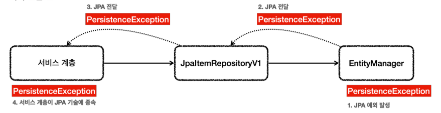
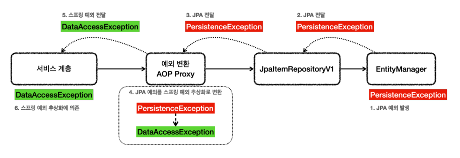

# JPA 예외 변환
JPA의 경우 예외가 발생하면 JPA 예외가 발생하게 된다.
```java
@Repository
@Transactional
public class JpaItemRepositoryV1 implements ItemRepository {
    private final EntityManager em;

    @Override
    public Item save(Item item) {
        em.persist(item);
        return item;
    }
}
```
* ```EntityManager``` 는 순수한 JPA 기술이고, 스프링과는 관계가 없다. 따라서 엔티티 매니저는 예외가 발생하면 JPA 관련 예외를 발생시킨다.
* JPA는 ```PersistenceException``` 과 그 하위 예외를 발생시킨다.
  * 추가로 JPA는 ```IllegalStateException``` , ```IllegalArgumentException``` 을 발생시킬 수 있다.
* 그렇다면 JPA 예외를 스프링 예외 추상화( ```DataAccessException``` )로 어떻게 변환할 수 있을까?
* 비밀은 바로 ```@Repository```에 있다.

<br>

## 예외 변환 전


<br>

## @Repository의 기능
* ```@Repository```가 붙은 클래스는 컴포넌트 스캔의 대상이 된다.
* ```@Repository```가 붙은 클래스는 예외 변환 AOP의 적용 대상이 된다.
  * 스프링과 JPA를 함께 사용하는 경우 스프링은 JPA 예외 변환기( ```PersistenceExceptionTranslator``` )를 등록한다.
  * 예외 변환 AOP 프록시는 JPA 관련 예외가 발생하면 JPA 예외 변환기를 통해 발생한 예외를 스프링 데이터 접근 예외로 변환한다.

<br>

## 예외 변환 후


결과적으로 리포지토리에 ```@Repository``` 애노테이션만 있으면 스프링이 예외 변환을 처리하는 AOP를 만들어준다

> 참고<br>
> 스프링 부트는 ```PersistenceExceptionTranslationPostProcessor``` 를 자동으로 등록하는데, 여기에서 ```@Repository```를 AOP 프록시로 만드는 어드바이저가 등록된다.<br>
> 복잡한 과정을 거쳐서 실제 예외를 변환하는데, 실제 JPA 예외를 변환하는 코드는 ```EntityManagerFactoryUtils.convertJpaAccessExceptionIfPossible()```이다.