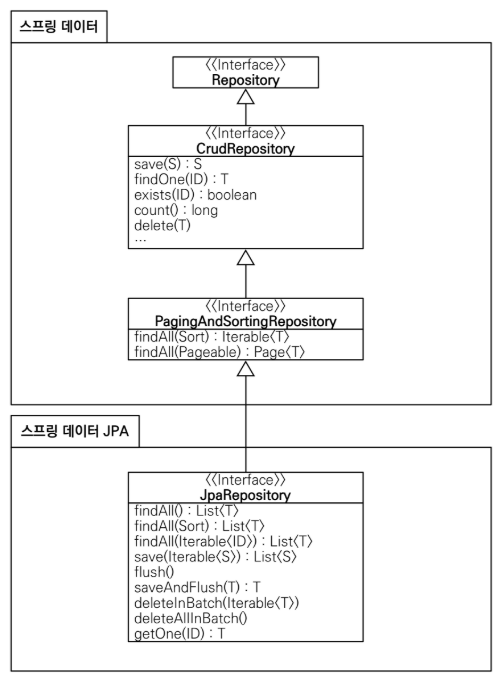
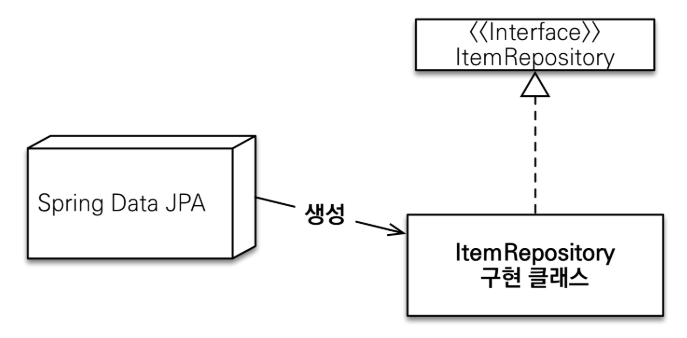

# Spring Data JPA
스프링 데이터 JPA는 JPA를 편리하게 사용할 수 있도록 도와주는 라이브러리이다.<br>
수 많은 편리한 기능을 제공하지만 가장 대표적인 기능은 다음과 같다.

* 공통 인터페이스 기능
* 쿼리 메서드 기능

<br>

## 공통 인터페이스 기능


* ```JpaRepository``` 인터페이스를 통해서 기본적인 CRUD 기능 제공한다.
* 공통화 가능한 기능이 거의 모두 포함되어 있다.
* ```CrudRepository``` 에서 ```fineOne()``` -> ```findById()```로 변경되었다.

<br>

### JpaRepository 사용법
```java
public interface ItemRepository extends JpaRepository<Item, Long> {
}
```
* ```JpaRepository```인터페이스를 인터페이스 상속 받고, 제네릭에 관리할 ```<엔티티, 엔티티ID>``` 를 주면 된다.
* 그러면 ```JpaRepository```가 제공하는 기본 CRUD 기능을 모두 사용할 수 있다.

<br>

### 스프링 데이터 JPA가 구현 클래스를 대신 생성

* ```JpaRepository``` 인터페이스만 상속받으면 스프링 데이터 JPA가 프록시 기술을 사용해서 구현 클래스를 만들어준다. 그리고 만든 구현 클래스의 인스턴스를 만들어서 스프링 빈으로 등록한다.
* 따라서 개발자는 구현 클래스 없이 인터페이스만 만들면 기본 CRUD 기능을 사용할 수 있다.

<br>

## 쿼리 메서드 기능
스프링 데이터 JPA는 인터페이스에 메서드만 적어두면, 메서드 이름을 분석해서 쿼리를 자동으로 만들고 실행해주는 기능을 제공한다.

<br>

### 순수 JPA 리포지토리
```java
public List<Member> findByUsernameAndAgeGreaterThan(String username, int age) {
 return em.createQuery("select m from Member m where m.username = :username and m.age > :age")
         .setParameter("username", username)
         .setParameter("age", age)
         .getResultList();
}
```
순수 JPA를 사용하면 직접 JPQL을 작성하고, 파라미터도 직접 바인딩 해야 한다.

<br>

### 스프링 데이터 JPA
```java
public interface MemberRepository extends JpaRepository<Member, Long> {
    List<Member> findByUsernameAndAgeGreaterThan(String username, int age);
}
```
* 스프링 데이터 JPA는 메서드 이름을 분석해서 필요한 JPQL을 만들고 실행해준다. 물론 JPQL은 JPA가 SQL로 번역해서 실행한다.
* 물론 그냥 아무 이름이나 사용하는 것은 아니고 다음과 같은 규칙을 따라야 한다.

<br>

### 스프링 데이터 JPA가 제공하는 쿼리 메소드 기능
* 조회: ```find…By```, ```read…By```, ```query…By```, ```get…By```
  * 예:) ```findHelloBy```처럼 ...에 식별하기 위한 내용(설명)이 들어가도 된다.
* COUNT: ```count…By``` 반환타입 ```long```
* EXISTS: ```exists…By``` 반환타입 ```boolean```
* 삭제: ```delete…By``` , ```remove…By``` 반환타입 ```long```
* DISTINCT: ```findDistinct``` , ```findMemberDistinctBy```
* LIMIT: ```findFirst3``` , ```findFirst``` , ```findTop``` , ```findTop3```

> 쿼리 메소드 필터 조건<br>
> 스프링 데이터 JPA 공식 문서 참고<br>
> https://docs.spring.io/spring-data/jpa/docs/current/reference/html/#jpa.querymethods.query-creation <br>
> https://docs.spring.io/spring-data/jpa/docs/current/reference/html/#repositories.limit-queryresult

<br>

### JPQL 직접 사용하기
```java
public interface SpringDataJpaItemRepository extends JpaRepository<Item, Long> {

    //쿼리 메서드 기능
    List<Item> findByItemNameLike(String itemName);

    //쿼리 직접 실행
    @Query("select i from Item i where i.itemName like :itemName and i.price <= :price")
    List<Item> findItems(@Param("itemName") String itemName, @Param("price") Integer price);
}
```
* 쿼리 메서드 기능 대신에 직접 JPQL을 사용하고 싶을 때는 @Query 와 함께 JPQL을 작성하면 된다. 이때는 메서드 이름으로 실행하는 규칙은 무시된다.
* 참고로 스프링 데이터 JPA는 JPQL 뿐만 아니라 JPA의 네이티브 쿼리 기능도 지원하는데, JPQL 대신에 SQL을 직접 작성할 수 있다.

> 중요<br>
> 스프링 데이터 JPA는 JPA를 편리하게 사용하도록 도와주는 도구이다. 따라서 JPA 자체를 잘 이해하는 것이 가장 중요하다.