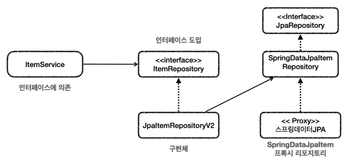
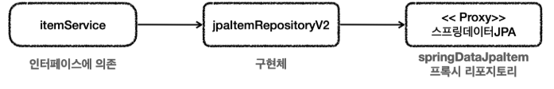

# 스프링 데이터 JPA 적용
기존 코드를 유지하면서 Spring Data JPA를 적용해보자.

<br>

### 의존관계와 구조
* ```ItemService``` 는 ```ItemRepository``` 에 의존하기 때문에 ItemService 에서 ```SpringDataJpaItemRepository``` 를 그대로 사용할 수 없다.
* 물론 ```ItemService``` 가 ```SpringDataJpaItemRepository``` 를 직접 사용하도록 코드를 고치면 되겠지만, 우리는 ```ItemService``` 코드의 변경없이 ```ItemService``` 가 ```ItemRepository``` 에 대한 의존을 유지하면서 DI를
  통해 구현 기술을 변경하고 싶다.

조금 복잡하지만, 새로운 리포지토리를 만들어서 이 문제를 해결해보자.<br>
여기서는 ```JpaItemRepositoryV2``` 가 ```ItemRepository``` 와 ```SpringDataJpaItemRepository``` 사이를 맞추기 위한 어댑터 처럼 사용된다.

<br>

### 클래스 의존 관계

* ```JpaItemRepositoryV2```는 ```ItemRepository```를 구현한다. 그리고 ```SpringDataJpaItemRepository```를 사용한다.

<br>

### 런타임 객체 의존 관계

* 런타임의 객체 의존관계는 다음과 같이 동작한다.
* ```itemService``` -> ```jpaItemRepositoryV2``` -> ```springDataJpaItemRepository(프록시 객체)```

<br>

이렇게 중간에서 ```JpaItemRepository``` 가 어댑터 역할을 해준 덕분에 ```ItemService```가 사용하는
```ItemRepository```인터페이스를 그대로 유지할 수 있고 클라이언트인 ```ItemService```의 코드를 변경하지 않아도 되는 장점이 있다.