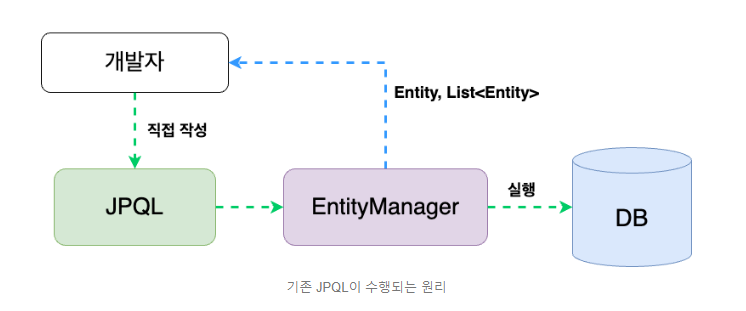
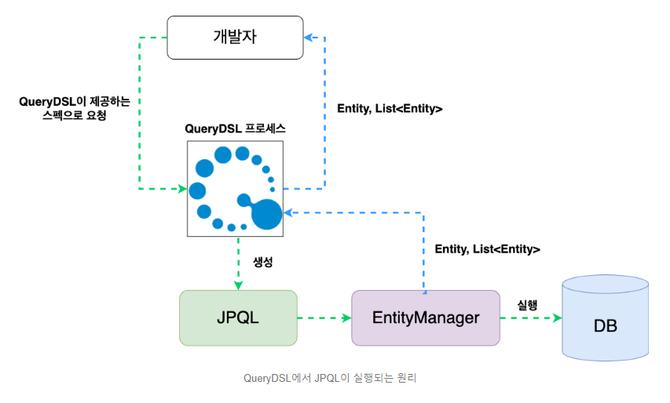

# 데이터 접근 기술 - Querydsl
DSL는 Domain Specific Language의 약자로, 특정 영역에 특화된 언어를 의미한다. 그런 의미에서 QueryDSL은 쿼리생성에 특화된 프레임워크를 의미한다.<br>

그럼 QueryDSL이 필요한 이유는 무엇일까?

JPA는 객체지향어플리케이션과 관계형DB 사이의 패러다임 불일치를 해결하는 프레임워크이다. 개발자는 객체지향 관점으로 개발하고 JPA프레임워크는 자동으로 SQL쿼리문을 생성한다.
SQL문이 자동으로 생성되니 개발자는 SQL 관점 프로그래밍을 하지 않아도 된다. ```그러나 완전한 분리는 불가능하다```. 복잡한 쿼리 생성을 위해, JPA는 ```JPQL```을 지원한다.

JPQL은 SQL문과 상당히 유사하다. 객체지향적 관점을 유지하고 있는 SQL문 정도로 보면된다.<br>
그러나 여기에는 크게 두 가지 문제가 있다.

<br>

1. 타입안정성이 떨어진다.
    ```java
    //작성된 JPQL문
    String jpql = "SELECT p.category, AVG(p.price) FROM Product p " +
                  "GROUP BY p.category " +
                  "HAVING AVG(p.price) > :averagePrice";
    ```
    JPQL은 문자열이다.
    
    문자열이기에 개발자는 JPQL문법이 틀려도 이를 알아차리지 못한다. 그래서 런타임 중에 메소드가 호출되어 JPQL이 파싱되어야 문법오류를 발견할 수 있다.
    @Query 어노테이션을 사용하면 프로그램이 올라가는 과정에 문법 오류를 발견 할수 있지만, 이것도 결국은 프로그램을 실행해야만 오류를 발견할 수 있다.
    즉, JPQL을 파싱하는 프로세스가 동작해야만 문법오류를 발견할 수 있고 컴파일 과정에서는 어떤 오류도 발견할 수 없다. ```한마디로 타입안정성이 떨어진다.```

<br>

2. 직관적인 동적쿼리 작성이 어렵다.

    JPQL은 문자열이다.

    동적쿼리를 작성하려면 문자열을 조작하는 방식으로 로직을 구성해야 한다. 그러다보니 문자열과 문자열 사이에 if-else문이나 for문 같은 코드가 들어가 가독성을 떨어트린다.

    ```java
    String jpqlQuery = "select m from Member m";
    
    if(id != null){ //id가 NULL이 아니면
        jpql += "where id = :id"; // WHERE 조건문 추가
    }
    
    TypedQuery<Member> query = em.createQuery(jpqlQuery, Member.class);
    
    if(id != null){ //id가 NULL이 아니면
        query = query.setParameter("id", id); // 파라미터 추가
    }
    ```
   이외에도, JPA는 동적쿼리 작성을 위한 JPA 표준기술인 Criteria도 제공하지만 전혀 직관적이지 못하다.(Criteria를 사용하면 코드가 엄청 복잡해진다.)<br>
   QueryDSL은 JPA가 지원하는 표준기술은 아니지만 타입안정성을 보장하고 직관적인 동적쿼리 작성이 가능하다.<br>
   이런 이유로 실무에서 JPA와 연계되어, 가장 많이 사용되는 프레임워크 중 하나이다.

<br>

## QueryDSL 동작원리


개발자(클라이언트)가 JPQL을 문자열로 직접 작성하면, 타입 안정성을 체크할 수 없고 직관적인 동적쿼리도 작성할 수 없다. QueryDSL은 JPQL을 대신 생성하여 이런 문제를 해결한다.



QueryDSL의 목적은 JPQL 생성이다.
개발자는 QueryDSL이 JPQL을 생성할 수 있도록 필요한 데이터를 세팅하여 전달해야 한다. 일단 Entity 정보가 필요하다. 그러나 Entity는 JPA프레임워크에서 지원하는 모듈이다.
QueryDSL은 쿼리생성에 특화된 프레임워크로, JPA 프레임워크와 분리되어 있다. 그러므로 다른 프레임워크의 모듈을 그대로 사용하면 JPA 프레임워크에 종속되어버린다.
이런 현상을 막고자, QueryDSL은 Entity 정보를 담은 ```Q타입클래스```를 사용한다.

Q타입클래스는 QueryDSL 플러그인으로 컴파일하면 지정된 위치에 생성된다.
개발자는 Q타입객체를 생성하여 JPQL 생성에 필요한 데이터를 QueryDSL 프로세스에 넘길 수 있다.(플러그인 설정이 굉장히 복잡하다는 단점이 있다.)

### QueryDSL 작성예시
```java
public List<Member> searchMember(MemberSearchCondition condition){
    QMember qMember = QMember.member; //Q타입 클래스 객체 생성

    return queryFactory
            .select(qMember) // select 메소드
            .from(qMember) // from 메소드
            .leftJoin(member.team, team) // leftJoin메소드
            .where( // where 메소드
                    usernameEq(condition.getUsername()), 
                    teamNameEq(condition.getTeamName()),
                    ageGoe(condition.getAgeGoe()),
                    ageLoe(condition.getAgeLoe())
            )
            .fetch(); //fetch메소드
}
```
위 코드는 QueryDSL 작성 예시이다.

QueryDSL 코드의 목적은 ```JPQL 생성용 데이터 세팅```이다.<br>
그러므로 QueryDSL은 데이터 세팅에 특화된 디자인 패턴인 빌더 패턴 구조로 이루어져 있다.
SELECT 절에 필요한 데이터는 select 메소드에 세팅하고, FROM 절에 필요한 데이터는 from 메소드에 세팅하고 WHERE절에 필요한 데이터는 where 메소드에 세팅하면 된다.
그리고 이런 메소드들이 파이프라인 구조로 되어 있어 가독성도 올라간다.

가장 중요한 데이터인 엔티티 데이터는 Q타입클래스 객체로 전달한다.
꼭 엔티티만 Q타입 객체로 만들어 전달할 수 있는 것은 아니다.
일반객체도 Q타입객체로 만들어 전달할 수 있다.

이처럼 QueryDSL이 JPQL 생성을 대신하여, 타입안정성 체크가 가능해지고 빌더 패턴 구조로 이루어져 있어 가독성있는 데이터 세팅이 가능해진다.
한 가지 단점이 있다면 JPA가 지원하는 표준기술이 아니다보니 설정하는 과정이 복잡하다.

<br>

## 결론 : ```Spring Data JPA``` + ```QueryDSL```
* Spring Data 프로젝트의 약점은 조회이다.
* QueryDSL로 복잡한 조회 기능 보완하자!
  * 복잡한 쿼리
  * 동적 쿼리
* 단순한 경우 : Spring Data JPA
* 복잡한 경우 : QueryDSL 직접 사용
* JPQL로 해결하기 어려운 복잡한 쿼리는 네이티브 SQL 쿼리 사용(JdbcTemplate, MyBatis)