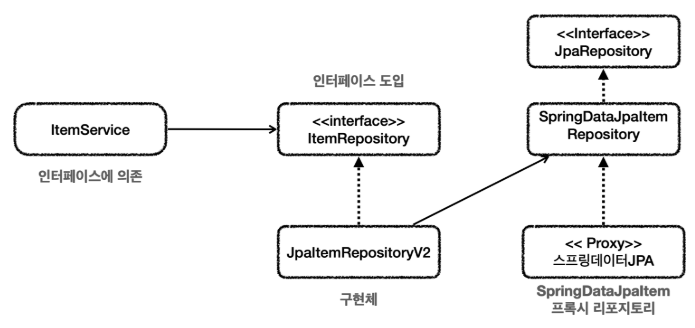

# 스프링 데이터 JPA 예제와 트레이드 오프
스프링 데이터 JPA 예제를 다시 한번 돌아보자.
### 클래스 의존 관계


### 런타임 객체 의존 관계


* 중간에서 ```JpaItemRepositoryV2```가 어댑터 역할을 해준 덕분에 ```ItemService```가 사용하는
  ```ItemRepository```인터페이스를 그대로 유지할 수 있고 클라이언트인 ```ItemService```의 코드를 변경하지 않아도 되는 장점이 있다.

<br>

### 고민
* 구조를 맞추기 위해서, 중간에 어댑터가 들어가면서 전체 구조가 너무 복잡해지고 사용하는 클래스도 많아지는 단점이 생겼다.
* 실제 이 코드를 구현해야하는 개발자 입장에서 보면 중간에 어댑터도 만들고, 실제 코드까지 만들어야 하는 불편함이 생긴다.
* 유지보수 관점에서 ```ItemService```를 변경하지 않고, ```ItemRepository```의 구현체를 변경할 수 있는 장점이있다.
  그러니까 DI, OCP 원칙을 지킬 수 있다는 좋은 점이 분명히 있다. 하지만 반대로 구조가 복잡해지면서 어댑터 코드와 실제 코드까지 함께 유지보수 해야 하는 어려움도 발생한다.

<br>

### 다른 선택
여기서 완전히 다른 선택을 할 수도 있다.<br>
```ItemService```코드를 일부 고쳐서 직접 스프링 데이터 JPA를 사용하는 방법이다.<br>
DI, OCP 원칙을 포기하는 대신에, 복잡한 어댑터를 제거하고, 구조를 단순하게 가져갈 수 있는 장점이 있다.

<br>

### 클래스 의존 관계
1.png)
* ```ItemService```에서 스프링 데이터 JPA로 만든 리포지토리를 직접 참조한다. 물론 이 경우 ```ItemService```코드를 변경해야 한다.

<br>

### 런타임 객체 의존 관계
2.png)

이것이 바로 트레이드 오프다. 
* DI, OCP를 지키기 위해 어댑터를 도입하고, 더 많은 코드를 유지한다.
* 어댑터를 제거하고 구조를 단순하게 가져가지만, DI, OCP를 포기하고, ```ItemService```코드를 직접 변경한다.

결국 여기서 발생하는 트레이드 오프는 구조의 안정성 vs 단순한 구조와 개발의 편리성 사이의 선택이다.<br>
이 둘 중에 하나의 정답만 있을까? 그렇지 않다. 어떤 상황에서는 구조의 안정성이 매우 중요하고, 어떤 상황에서는 단순한 것이 더 나은 선택일 수 있다.

개발을 할 때는 항상 자원이 무한한 것이 아니다. 그리고 어설픈 추상화는 오히려 독이 되는 경우도 많다. 무엇보다 추상화도 비용이 든다.
인터페이스도 비용이 든다. 여기서 말하는 비용은 유지보수 관점에서 비용을 뜻한다. 이 추상화 비용을 넘어설 만큼 효과가 있을 때 추상화를 도입하는 것이 실용적이다.

이런 선택에서 하나의 정답이 있는 것은 아니지만, 프로젝트의 현재 상황에 맞는 더 적절한 선택지가 있다고 생각한다.
그리고 현재 상황에 맞는 선택을 하는 개발자가 좋은 개발자라 생각한다.
